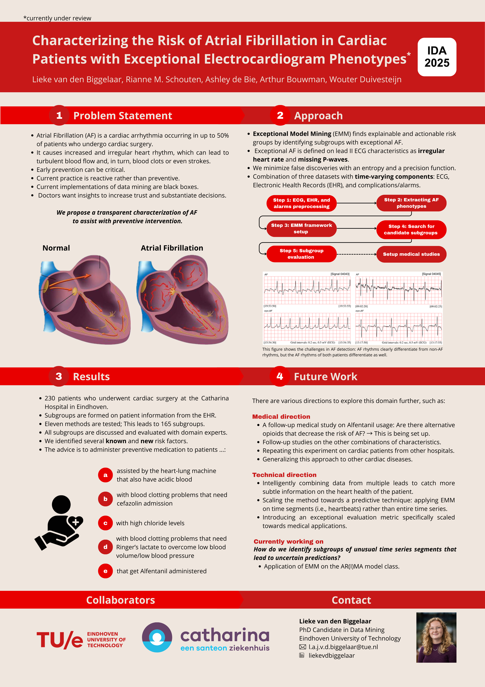

I presented the focus of my PhD and discussed our research on stratified medicine for atrial fibrillation using Exceptional Model Mining during a pitch presentation and poster presentation in the PhD Forum. ([abstract](LiekevandenBiggelaar.github.io/files/IDA2025_Abstract.pdf)).

