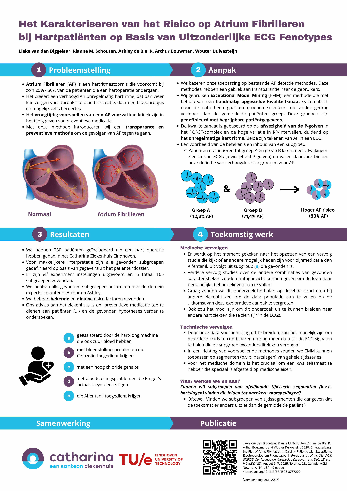

The hospital that we collaborate with organizes a science day every year so their staff members can get great coffee and chat about the research that the hospital does. This research is presented as posters. I presented our work on stratified medicine for Atrial Fibrillation as a poster. The talk and poster are in Dutch.

