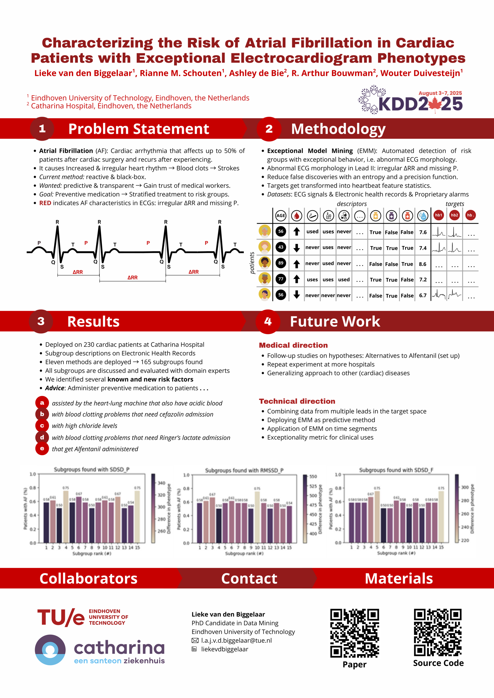

I presented the work covered in our accepted paper to the applied data science track at KDD 2025. Our work focused on using a transparent and actionable framework called Exceptional Model Mining to detect subgroups of patients that are at higher risk of developing Atrial Fibrillation after cardiac surgery. These subgroups are advised to give preventive treatment, making this a move towards stratified medicine. The risk of atrial fibrillation is detected using a model based on abnormal ECG phenotypes captured in the Exceptional Model Mining framework. Our material can be found here: ([paper](LiekevandenBiggelaar.github.io/files/KDD2025_Paper.pdf), [supplement](LiekevandenBiggelaar.github.io/files/KDD2025_SupplementaryPaper.pdf), [code](https://github.com/liekevandenbiggelaar/EAFM)).

